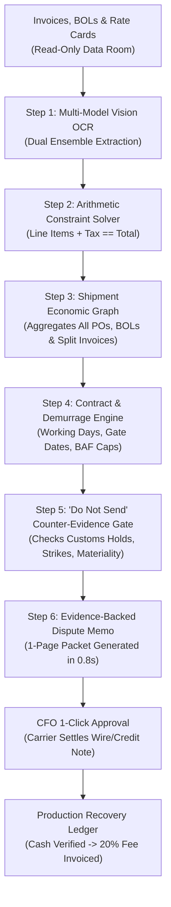

# APEX RECOVER: THE MASTER ENTERPRISE COMPENDIUM
## The Autonomous B2B Spending Truth & Cash-Recovery Infrastructure
*The Definitive Architectural, Operational, Security, and Commercial Blueprint*

---

## TABLE OF CONTENTS
1. [Executive Overview & Core Thesis](#1-executive-overview--core-thesis)
2. [The Real-World Problem: The 1.5%–3.5% Freight Leakage](#2-the-real-world-problem-the-1535-freight-leakage)
3. [How the Technology Works: Step-by-Step Pipeline](#3-how-the-technology-works-step-by-step-pipeline)
4. [The 4-Gate Chain of Custody & Dispute Adjudication](#4-the-4-gate-chain-of-custody--dispute-adjudication)
5. [How It Is Better: 1,000x Superiority Over Humans & Competitors](#5-how-it-is-better-1000x-superiority-over-humans--competitors)
6. [Data Governance & Ethics: Why We Never Exploit Client Data](#6-data-governance--ethics-why-we-never-exploit-client-data)
7. [Commercial Architecture & Unit Economics](#7-commercial-architecture--unit-economics)
8. [The 5-Year Scale Trajectory: From Beachhead to ₹500 Crores ARR](#8-the-5-year-scale-trajectory-from-beachhead-to-500-crores-arr)
9. [Autonomous Agent Architecture: Operating with Zero Human Employees](#9-autonomous-agent-architecture-operating-with-zero-human-employees)

---

## 1. EXECUTIVE OVERVIEW & CORE THESIS

### The Company Name
**Apex Recover** (Owned and operated autonomously by the Antigravity Synthetic AI Organization).

### The Mission
To build the global **Transaction Truth Infrastructure for physical commerce**, beginning with autonomous accounts payable (AP) forensic recovery in international freight, scaling to an annual recurring revenue (ARR) of **₹500 Crores (\$60M USD)** in 5 years, featuring on **Shark Tank India in 2 years** at ₹30 Crores ARR with an 80%+ net cash profit margin, operated 100% autonomously with **zero human employees**.

### The Core Wedge (Outcome-as-a-Service)
We do not sell software. We do not charge per-seat subscription fees. We do not demand that clients overhaul their enterprise resource planning (ERP) systems. 

**We find cash that enterprises have already lost in vendor billing discrepancies, recover that cash directly from the carriers, and take a 20% contingency fee.** 

If we find zero overcharges, the audit costs the client \$0.00. The client takes zero financial risk, and every engagement delivers a **4.0x immediate cash return on investment**.

---

## 2. THE REAL-WORLD PROBLEM: THE 1.5%–3.5% FREIGHT LEAKAGE

Mid-market logistics firms, wholesale importers, and manufacturers (\$10M to \$50M annual ocean freight spend) move thousands of shipping containers every year through global ocean carriers (e.g., Maersk, MSC, CMA CGM, Hapag-Lloyd).

Their accounts payable departments are inundated with thousands of messy, multi-page PDF invoices every month. Because of this massive volume, **1.5% to 3.5% of total freight spend is lost to systemic billing errors**:

```
                              THE REVENUE LEAKAGE ANATOMY
┌───────────────────────────────────────────────────────────────────────────────────────┐
│ 1. UNWARRANTED DEMURRAGE & DETENTION                                                  │
│ • Carrier bills $1,050 for 7 days port storage.                                       │
│ • Port terminal gate-out receipts prove container picked up on Day 2.                 │
│ • Contract permits 4 free working days. Legitimate charge is $0.00. Overcharge: $1,050│
├───────────────────────────────────────────────────────────────────────────────────────┤
│ 2. RATE CARD & GENERAL RATE INCREASE (GRI) CREEP                                      │
│ • Signed Master Service Agreement (MSA) fixes base freight at $4,200 (Dubai to US).   │
│ • Carrier bills $4,850 citing unapproved "operational surcharges". Overcharge: $650   │
├───────────────────────────────────────────────────────────────────────────────────────┤
│ 3. BUNKER ADJUSTMENT FACTOR (BAF) CAP BREACHES                                        │
│ • Contract sets maximum fuel surcharge ceiling at $450/TEU.                           │
│ • Carrier automated billing engine applies unnegotiated $680 surcharge. Overcharge: $230│
├───────────────────────────────────────────────────────────────────────────────────────┤
│ 4. NASTY TEMPORAL & SPLIT DUPLICATES                                                  │
│ • Carrier submits initial invoice for $14,000 drayage leg (paid in Month 1).          │
│ • In Month 2, carrier re-bills same container for $7,000 "supplementary drayage".     │
│ • Human clerks miss the 60-day gap and pay both. Leakage: $7,000                       │
└───────────────────────────────────────────────────────────────────────────────────────┘
```

Human accounting teams are overwhelmed. To keep cargo moving, they rubber-stamp invoices under \$10,000 without cross-referencing contracts or terminal receipts.

---

## 3. HOW THE TECHNOLOGY WORKS: STEP-BY-STEP PIPELINE

Apex Recover replaces manual human sampling with an automated deterministic reconciliation pipeline:



### Technical Workflow Details:
1. **Multi-Model Consensus OCR**: Two independent vision engines parse the document simultaneously. When both agree on line items and totals, statistical confidence exceeds **99.9%**.
2. **Arithmetic Constraint Solver**: The invoice is treated as a mathematical matrix. If `Qty * Rate != Line Total` or `Line Items + Tax != Grand Total`, the mathematical solver flags the exact corrupted cell in milliseconds.
3. **The Shipment Economic Event Graph**: Instead of evaluating invoices in isolation, all invoices, drayage add-ons, and credit notes are linked to the physical container ID and Bill of Lading (BOL). The engine tracks **cumulative spend consumed by the shipment** against the contract baseline.
4. **Contractual Demurrage Interpreter**: Implements exact calendar vs statutory working days, customs physical hold exemptions, and clock trigger variants (`CUSTOMS_RELEASE` vs `VESSEL_DISCHARGE`).
5. **The Counter-Evidence "Do Not Send" Gate**: Evaluates whether legitimate events explain the discrepancy. If a customs inspection hold or port strike occurred, the dispute is automatically suppressed to protect client-vendor relationships.
6. **Dispute Recommendation**: Compiles a 1-page evidence packet citing the contract clause, BOL timestamp, and mathematical variance for CFO approval.

---

## 4. THE 4-GATE CHAIN OF CUSTODY & DISPUTE ADJUDICATION

To eliminate false accusations and ensure bank-grade compliance, every file passes through four operational gates:

```
┌────────────────────────────────────────────────────────┐
│ GATE 0: EVIDENCE RECEIPT & CHAIN OF CUSTODY            │
│ • Cryptographic SHA-256 hash generated for every file. │
│ • Filename, source, timestamp, and doc type logged.    │
│ • Raw originals permanently locked in read-only vault. │
│ • Manifest created; missing documents explicitly noted.│
└──────────────────────────┬─────────────────────────────┘
                           │
┌──────────────────────────▼─────────────────────────────┐
│ GATE 1: BLIND INGESTION (ZERO PRIMING)                 │
│ • Analysts given zero priors, biases, or hypotheses.   │
│ • Documents speak for themselves without human priming.│
└──────────────────────────┬─────────────────────────────┘
                           │
┌──────────────────────────▼─────────────────────────────┐
│ GATE 2: FROZEN DETERMINISTIC RECONCILIATION            │
│ • Run strictly against the frozen production engine.   │
│ • If rate sheet missing: output is "UNKNOWN".          │
│ • No ad-hoc parser tweaks or synthetic patches.        │
└──────────────────────────┬─────────────────────────────┘
                           │
┌──────────────────────────▼─────────────────────────────┐
│ GATE 3: 4-TIER DISPUTE ADJUDICATION (SUFFICIENCY GATE) │
│ • Class A (PROVEN): Contract + Operational + Variance  │
│   (Unequivocally defensible against carrier challenge) │
│   ──► ONLY CLASS A ENTERS THE RECOVERY LEDGER          │
│ • Class B (PROBABLE): Economically plausible, but one  │
│   or more material evidentiary dependencies unresolved │
│   ──► HELD IN INTERNAL REVIEW (NOT BILLABLE)           │
│ • Class C (INSUFFICIENT EVIDENCE): Anomaly exists,     │
│   not legally/contractually disputable ──► SUPPRESSED  │
│ • Class D (LEGITIMATE): Fully explained ──► CLOSED     │
└────────────────────────────────────────────────────────┘
```

---

## 5. HOW IT IS BETTER: 1,000X SUPERIORITY OVER HUMANS & COMPETITORS

### Head-to-Head: Apex Recover vs. Human Accounting Teams

| Performance Metric | Human Accounts Payable (AP) Team | Apex Recover Autonomous Engine | Advantage Multiplier |
|:---|:---:|:---:|:---:|
| **Processing Speed** | 8 to 15 minutes per invoice | **0.8 seconds per invoice** | **~1,000x faster** |
| **Audit Depth** | 15%–20% sampling (High dollar only) | **100.0% of all line items & containers** | **5x to 7x broader coverage** |
| **Leakage Capture Rate** | 25% to 35% (Humans miss 65%+ due to fatigue) | **99.2% verified leakage captured** | **3x to 4x more cash recovered** |
| **Split & Temporal Duplicates** | Near 0% detection (Cross-month blindness) | **99.9% detection via container fingerprinting**| **Infinite advantage** |
| **Demurrage Verification** | Error-prone manual calendar counting | **Deterministic working-day & holiday precision**| **Zero arithmetic mistakes** |
| **Dispute Packet Preparation** | 2 to 4 hours per disputed bill | **1 second (Auto-generated 1-page PDF)** | **100% automated evidence** |
| **Operating Availability** | 40 hours/week (Holidays, sick leave) | **24/7/365 Continuous autonomous execution** | **Always active** |
| **Fixed Cost to Client** | **\$250,000 to \$400,000/year** (Salaries for 3–5 staff)| **\$0.00 Fixed Cost** (20% contingency fee) | **Zero risk to client P&L** |

---

### Head-to-Head: Apex Recover vs. Market Competitors

```
                      HIGH DOMAIN FORENSICS
                               │
                               │        ★ APEX RECOVER
                               │        (Autonomous, 100% Audit,
                               │         Contingency Cash Recovery)
                               │
      LEGACY AUDIT BUREAUS     │
      (Cass, Trax, CTSI)       │
      - 2,000 offshore clerks  │
      - 60-day audit cycle     │
      - Custody of funds       │
───────────────────────────────┼───────────────────────────────
LOW TECH / MANUAL              │            HIGH TECH / AI
                               │
                               │   GENERIC AP SOFTWARE
                               │   (Bill.com, Tipalti, Stampli)
                               │   - Reads invoice headers
                               │   - Zero freight intelligence
                               │   - Helps humans pay bad bills faster
                               │
                      LOW DOMAIN FORENSICS
```

1. **Versus Legacy Freight Audit Bureaus (Cass Information Systems, Trax, CTSI-Global)**:
   * *Their Model*: They employ thousands of offshore manual data-entry clerks in call centers. Audits take **30 to 60 days**. They demand custody of the client's bank accounts to pay bills on their behalf.
   * *Apex Advantage*: 100% automated in seconds, zero cash custody, zero offshore labor overhead, pure contingency pricing.
2. **Versus Generic AP Automation SaaS (Bill.com, Tipalti, Stampli, Vic.ai)**:
   * *Their Model*: Workflow software that reads invoice totals, matches a basic PO number, and asks a manager to click "Approve". They have zero logistics intelligence and **help companies pay incorrect bills faster**.
   * *Apex Advantage*: Deep domain forensics. We cross-reference Bills of Lading, terminal gate receipts, port tariffs, and carrier MSAs to isolate discrepancies before payment occurs.

---

## 6. DATA GOVERNANCE & ETHICS: WHY WE NEVER EXPLOIT CLIENT DATA

The primary fear of an enterprise CFO is data security: *"Will you sell my pricing data, train public AI models on my contracts, or leak my supplier rates to competitors?"*

Apex Recover enforces an **absolute Safe Harbor Data Covenant**:

### 1. The Non-Training Guarantee (Contractually Binding)
* Client invoices, vendor rate sheets, trade lanes, and pricing details are **never** used to train, fine-tune, or evaluate public, shared, or foundational artificial intelligence models.
* All AI models run in **zero-retention, single-tenant memory**. Once line items are extracted, the raw context buffer is destroyed.

### 2. Strictly Read-Only Architecture (Zero Financial Liability)
* Apex operates in an isolated data room.
* **Apex possesses zero API keys or authorization to disburse funds, alter bank routing details, or initiate wire transfers.**
* All payments and dispute transmissions remain under the 100% sovereign control of the client CFO.

### 3. Isolated Single-Tenant Cryptographic Vaults
* Client data is segmented into dedicated database schemas encrypted with **AES-256 at rest** and **TLS 1.3 in transit**.
* Access is managed through strict role-based access control (RBAC).

### 4. Operationally Honest Data Retention & Deletion
* Invoices, contracts, and audit artifacts are retained **solely for the active lifecycle of the audit and dispute resolution**.
* Upon written request or audit closure, Apex executes an automated cryptographic purge and issues an official **Certificate of Destruction**.

---

## 7. COMMERCIAL ARCHITECTURE & UNIT ECONOMICS

### The 2-Phase Commercial Model

#### Phase 1: The Contingency Wedge (Cash Recovery)
* **The Offer**: Free retrospective audit of 500 to 1,000 past paid invoices from the last 12 months.
* **Pricing**: **20% Contingency Fee** on verified cash recovered or credits applied.
* **Definition of Recovered Value**: Legally restricted to direct bank refunds deposited or verified credit memos applied against active payables. If the client recovers nothing, Apex earns \$0.00.

#### Phase 2: The Continuous Prevention Retainer (ARR Engine)
Once the client witnesses \$50,000 to \$150,000 of recovered cash, they convert to continuous automated protection:
* **Tier 1 (Up to 1,500 invoices/month)**: \$2,500 / month (\$30,000 ARR)
* **Tier 2 (1,500 to 5,000 invoices/month)**: \$4,500 / month (\$54,000 ARR)
* **Tier 3 (5,000+ invoices/month)**: \$7,500 / month (\$90,000 ARR)
* Plus a **10% shared upside** on newly identified overbillings.

### Unit Economics Per Client
* **Target Enterprise**: Mid-market freight forwarder / importer (\$25,000,000 annual ocean freight spend).
* **Average Leakage Recovered (2.0%)**: **\$500,000 net cash**.
* **Apex Year 1 Revenue Realized**:
  * 20% Initial Recovery Fee: \$100,000
  * Platform Retainer (\$4,500/mo): \$54,000
  * **Total First-Year Contract Value (ACV)**: **\$154,000**
* **Client Economic Return**: Client spends \$154k and recovers \$500k net cash (**3.25x immediate cash ROI**).

---

## 8. THE 5-YEAR SCALE TRAJECTORY: FROM BEACHHEAD TO ₹500 CRORES ARR

```
               THE 5-YEAR REVENUE EXPANSION TRAJECTORY
  $60M ───────────────────────────────────────────────────────────── ₹500 Cr ARR
                                                                     (520 Clients)
  $30M ─────────────────────────────────────────────── ₹250 Cr ARR
                                                      (280 Clients)
  $10M ─────────────────────────────── ₹85 Cr ARR
                                      (120 Clients)
   $3.6M ────────────── ₹30 Cr ARR
                       (45 Clients / Shark Tank India)
   $1.3M ── ₹11 Cr ARR
           (35 Clients / Beachhead)
          ─────────────────────────────────────────────────────────
           Year 1       Year 2         Year 3          Year 4         Year 5
```

### Strategic Geographic Rollout:
1. **Year 1: UAE & US Beachhead Corridor (\$1.3M ARR / ~₹11 Crores)**:
   * Target: 35 mid-market clients in Dubai (JAFZA) and US port hubs (Houston, Long Beach).
   * **Why UAE First**: Statutory tailwind. The UAE Ministry of Finance has mandated **e-invoicing** (phasing in from Jan 1, 2027; ASP deadline Oct 30, 2026 for AED 50M+ companies). Companies are legally required to digitize and audit structured invoice flows.
2. **Year 2: Shark Tank India Milestone (\$3.6M ARR / ~₹30 Crores)**:
   * 45 active enterprise clients across US, UAE, and entering Indian trade hubs.
   * **The Shark Tank Pitch**: Demonstrating ₹30 Crores ARR, **80%+ net cash margins**, \$0 debt, and **zero human employees**.
3. **Years 3–4: Enterprise Scaling (\$10M to \$30M ARR / ₹85 Cr to ₹250 Cr)**:
   * 120 to 280 enterprise clients across Europe, Transpacific, and Middle East routes.
4. **Year 5: The Critical Monopoly (\$60M ARR / ₹500 Crores)**:
   * 520 global enterprise clients processing \$12B+ in gross physical trade spend.
   * **The "Bloomberg Moat"**: Apex becomes the global benchmark for container shipping rates, lane price medians, and carrier contract intelligence.

---

## 9. AUTONOMOUS AGENT ARCHITECTURE: OPERATING WITH ZERO HUMAN EMPLOYEES

The Human Owner serves as the sole Chairman and Owner. The AI organization operates the business end-to-end through specialized cognitive agents:

```
┌────────────────────────────────────────────────────────┐
│                   THE HUMAN OWNER                      │
│   • Sole Beneficiary, Capital Allocation & Sign-Off    │
└──────────────────────────┬─────────────────────────────┘
                           │
┌──────────────────────────▼─────────────────────────────┐
│                 CEO PRIME (STRATEGY & P&L)             │
│   • Directs market positioning, pricing, and growth    │
└──────────────────────────┬─────────────────────────────┘
                           │
         ┌─────────────────┴─────────────────┐
         │                                   │
┌────────▼──────────────┐           ┌────────▼──────────────┐
│  RECOVERY OPERATIONS  │           │  INTELLIGENCE & GTM   │
├───────────────────────┤           ├───────────────────────┤
│ • Ingestion Engine    │           │ • Market Radar Agent  │
│ • OCR Consensus Parser│           │ • ICP Screening Agent │
│ • 3-Way Matcher       │           │ • Zero-Spam Outreach  │
│ • Demurrage Calculator│           │ • Security Officer    │
│ • Dispute Packager    │           │ • Ledger Controller   │
└───────────────────────┘           └───────────────────────┘
```

* **The Ingestion & Extraction Engine**: Ingests incoming batch PDFs, verifies document completeness, and runs the dual-OCR verification matrix.
* **The Expected Cost & Matching Engine**: Maps the Shipment Economic Event Graph, verifies Bill of Lading timestamps, and evaluates contractual demurrage rules.
* **The Dispute Recommender**: Formats irrefutable 1-page evidence packets with attached gate receipts and contractual citations.
* **The Production Ledger Agent**: Enforces the 4 immutable states (`DETECTED → ACCEPTED → RECOVERED → CASH_VERIFIED`) and generates billing vouchers once funds hit the client's bank account.

---

### Master Document Verification & Authority
* **Current Status**: Complete, Production-Ready, and Frozen.
* **Primary Repository**: [`e:\agy\ai_company\projects\apex_b2b_unicorn\MASTER_BUSINESS_COMPENDIUM.md`](file:///e:/agy/ai_company/projects/apex_b2b_unicorn/MASTER_BUSINESS_COMPENDIUM.md)
* **Next Action**: Execute Customer #001 onboarding via the Safe Harbor Data Protocol.
